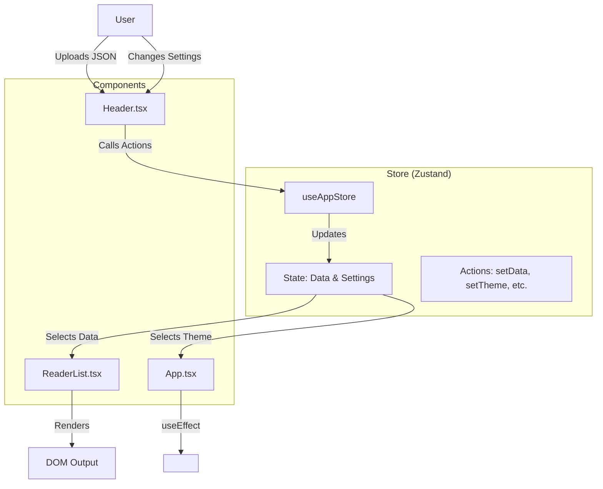

# Interlinear Language Reader

## Project Overview
This application is a React-based educational tool designed to assist language learners in reading text with an interlinear (line-by-line or word-by-word) translation method. It is agnostic to the source language but includes specific features for RTL (Right-to-Left) languages like Arabic or Hebrew.

Key features include:
- **Modular View**: Users can toggle visibility of the source sentence, word-by-word breakdown, and full translations independently.
- **Visual Customization**: Supports Light, Dark, and Sepia themes to reduce eye strain.
- **RTL Support**: Dynamically flips layout direction and text alignment.
- **Local Processing**: Parses JSON files entirely in the browser (no backend required).

## Architecture Map

The application follows a global store pattern using Zustand.

### Component Breakdown

1.  **store/useAppStore.ts (State Manager)**
    *   Centralizes all application state (Data content, UI settings, Theme).
    *   Provides atomic actions to modify state without prop drilling.

2.  **App.tsx (Root Controller)**
    *   Subscribes to the theme state.
    *   Manages the top-level CSS classes on the `<html>` element to trigger Tailwind dark/sepia modes.

3.  **Header.tsx (Control Layer)**
    *   Connects directly to the store to update settings.
    *   Contains the file upload logic which calls the `setData` action.

4.  **ReaderList.tsx (Presentation Layer)**
    *   Connects directly to the store to read data and display options.
    *   Handles layout calculations (RTL reversing, grid gaps) based on store settings.

5.  **utils/fileParser.ts (Logic Layer)**
    *   Encapsulates `FileReader` API and JSON validation logic.
